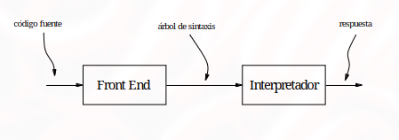
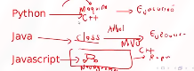
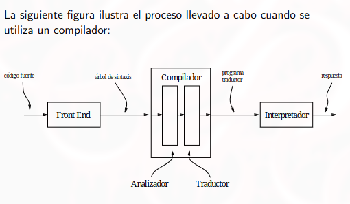
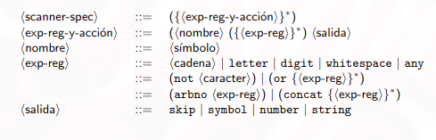
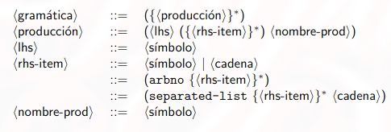

# Clase \#4

# Interpretación (Lenguajes interpretados)
* Un texto de un programa es escrito en un lenguaje llamado lenguaje fuente o definido.
1. Los programas son pasados a través de un `front end` se componen de: un parser, un scanner
  * *El scanner*  recibe como entrada el código fuente y retornar unidades sígnificativas del código
  * *El parser* recibe unidades significativas y retorna el árbol de sintaxis abstracta
2. Luego, el árbol de sintaxis abstracta es pasado a un interpretador, que examina su estructura y desarrolla algunas acciones que dependen de esa estructura
* Todo el código que escribimos es convertido en un árbol de sintaxis abstracta, para: 1.verificar que este correctamente escrito; 2.ejecutarlo

* Un interpretador es un programa que toma un árbol de sintaxis abstracta y lo convierte en una respuesta.
* Un interpretador está escrito en un lenguaje. Este lenguaje es llamado el *lenguaje de implementación* o el *lenguaje de definición* Ej: Para cada lenguaje el proceso es distinto (ver imagen)

* Los lenguajes interpretados son más lentos que los programas compilados  debido a que es necesario traducir el programa mientras se ejecuta
* Los lenguajes interpretados son más flexibles y favorecen la modularidad. Por esta razón se logra mayor velocidad de desarrollo de uso

## Compiladores (lenguajes compilados)

* Otra alternativa para el análisis y ejecución de programas es el uso de un compilador
* Un compilador traduce el árbol de sintaxis abstracta en un programa en otro lenguaje para ser ejecutado. Este lenguaje es llamado *lenguaje destino*
* El lenguaje generado puede ser ejecutado por un interpretador o puede ser traducido a un lenguaje de bajo nivel para su ejecución

* Por lo general el *lenguaje destino* es un lenguaje máquina interpretado por un hardware (asm)
* Otras implementaciones de lenguaje usan un lenguaje destino de propósito especial que es más simple que el original y para el cual es relativamente fácil escribir un interpretador (código intermedio u objeto) (Ej: Java transforma el código a archivos .class que luego son interpretados por la Java Virtual Machine, o Scala, Haskell y Erlang)
* Esto permite que el programa una vez y ejecutado en diferentes plataformas (multiplataforma)
* El tipo de lenguajes destino son llamados *lenguajes a bytecode* y sus interpretadores máquinas virtuales
* Un compilador esta dividido en dos partes: Un analizador y un traductor 
* El analizador tiene como finalidad deducir información útil sobre el programa (pej. descartar comentarios, espacios en blanco y saltos de linea)
* El traductor lleva a cabo un traducción del lenguaje a partir de la información del analizador

# Interpretación y compilación: Partes que componen el frontend, Scanner y parser
* Sin importar si un lenguaje es interpretado o compilado debe utilizar un frontend
* Dado que los programas son solo cadenas de caracteres, el frontend debe agrupar estos caracteres en unidades significativas (scanner)

## Scanning
Es el proceso de dividir la secuencia de caracteres en palabras, números, puntuación, comentarios, etc.

* Estas unidades son conocidas como *unidades léxicas, lexemas o tokens
* La especificación léxica de un lenguaje se refiere a la forma en la cual un programa debe ser dividido en unidades léxicas
* El scanner recibe una secuencia de caracteres y produce una secuencia de unidades léxicas (tokens)

La especificación léxica es una parte de la especificación del lenguaje que provee información como:

* Cualquier secuencia de espacios y nueva línea es equivalente a un solo espacio
* Un comentario comienza con `%` y continúa hasta el final de la línea
* Un identificador es una secuencia de letras y números, que comienza con una letra

Cuando un scanner encuentra un token, retorna una estructura de datos que consiste de al menos los siguientes datos:

* Una clase, la cual describe que clase de token encontró
* Un dato, que describe el token particular. pej. para interpretadores, el dato es un símbolo de Scheme construído de la cadena en el token; para números, el dato es el número descrito por el literal; y para cadenas, el dato es la cadena
* Un dato describe la ubicación del token en la entrada (número de línea y columna en la que se encuentra) (ayuda para indicar donde se encuentran errores de sintaxis al programador )

El conjunto de clases y la descripción de tonkens hacen parte de la especificación léxica

## Parsing
* Parsing el nombre que se le da al proceso de organizar una secuencia de tonkens en estructuras sintácticas jerárquicas como expresiones, estamentos y bloques
* La estructura sintáactica o gramátical de un lenguaje se refiere a la forma en la cual se deben orgranizar las unidades léxicas.
* El parser recibe una secuencia de tokens del scanner y produce un árbol de sintaxis abstracta

## Generador de parser
* Un generador de parser es un programa que toma como entrada un especificación léxica y una gramática y produce como salida un scanner y un parser para ellos
* Los tipos de datos de la gramática (con los cuales se basa un parser para general el árbol de sitnaxis) pueden ser descritos usando `define-datatype`
* Dada una gramática, debe haber un tipo de dato para cada símbolo no terminal; y debe haber una variante por cada producción que tenga símbolos no terminales en el lado derecho. Cada variante tendrá un campo por cada símbolo no terminal, identificador, o número que aparezca en su lado derecho

# Libreria SLLGEN

## Funcionamiento básico
## Especificación léxica en SLLGEN (Para scanner o analizador)
* SLLGEN es un generador de parsers que recibe como enterada una especificación léxica y una gramática y produce como salida, un scanner y un parser en scheme
* La especificación léxica en SLLGEN es una lista que satisface la siguiente gramática 

* A medida que el scanner trabaja, va recolectando caracteres en un búfer.
* Cuando el scanner determina que ha encontrado la cadena más larga posible de todas las expresiones regulares en la especificación, ejecuta la salida de la expresión regular correspondiente

Dicha salida puede ser:
* `skip`: Significa que es el final de un token, pero ningún token es emitido. El scanner continúa trabajando para encontrar el siguiente token. Esta acción es usada en espacios en blanco y comentarios (ignorar)
* `symbol`: los caracteres en el búfer son convertidos en un símbolo de scheme y un token es emitido, con el nombre symbol como su clase y con el símbolo como dato
* `ǹumber`: los caracteres en el búfer son convertidos en un número de scheme y un token es emitido, con el nombre number como su clase y con el número como dato
* `string`: Los caracters en el búfer son convertidos a una cadena de scheme y un token es emitido, con el nombre string como su clase y con la cadena como dato

## gramáticas en SLLGEN (Para parser)
* SLLGEn incluye un lenguaje para especificar gramáticas
* Una gramática en SLLGEN es una lista descrita por la siguiente gramática

* Lo más interesante es que, si esto no existiese, tendríamos que utilizar `define-datatype` para especificar cada uno de los símbolos terminales y no terminales de la gramática, pero mediante este método solo vamos a especificar la gramática como una lista y automáticamente se generaran todos los `define-datatype`
* En SLLGEN, la gramática debe permitir al parser determinar cuál producción usar conociendo solo:
  1. que símbolo no terminal se está buscando
  2. el primer símbolo (token) de la cadena al ser analizada 
* SLLGEN incluye procedimientos para incorporar los scanners y gramáticas en un parser ejecutable
* El procedimiento `sllgen:make-define-datatypes` genera cada una de las expresiones `define-datatype` de la gramática para ser usada por case* El procedimietno `sllgen-string-parser` es usado para construir un scanner y un parser basados en las especificaciones léxicas y gramaticales.
* Este procedimiento retorna un procedimietno que toma una cadena y produce un arbol de sintaxis abstracta
* La interfaz del usuario provista por la mayoría de implementaciones de scheme es un `read-eval-print-loop`, es decir, un ciclo que repite la acción de leer una expresión o definición, evaluarla e imprimirla como resultado
* SLLGEN puede ser usado para construir un `read-eval-print-loop`, usando los siguientes procedimientos
  1. `sllgen:make-stream-parser`: Toma un flujo de caracteres y genera un flujo de tokens
  2. `sllgen:make-rep-loop`: Toma una cadena str, un procedimiento de un solo argumento pro y un flujo de tonkens, y produce un `read-eval-print-loop` que crea un str como indicador en la salida estándar, lee el flujo de tokens, los analiza, imprime el resultado de aplicar el procedimiento pro al árbol de sintaxis abstracta resultante, y se llama recursivamente

# Ejemplos de interpretadores
A continuación 2 ejemplos de interpretadores, con comentarios sobre como se debe usar la Librería SLLGEN, especificación léxica y gramatical y otras funciones:
* Valores denotados: Valores que estan almacenados directamente en las varaibles
* Valores expresados: todas las posibles expresiones

* [1.interpretador sencillo](./4.ejercicios-clase-4/1.interpretador-sencillo.rkt) 
* [2.Intepretador simple](./4.ejercicios-clase-4/2.interpretador-sencillo.rkt) 
