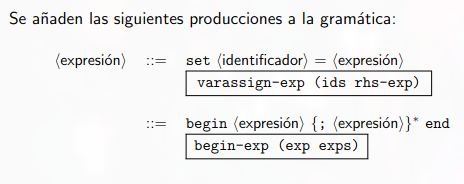
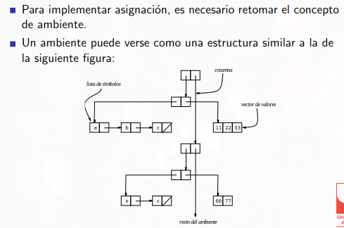
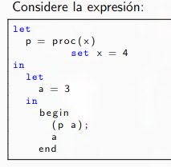
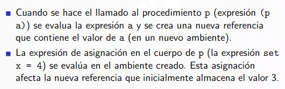
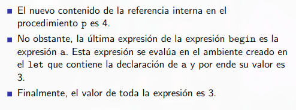

# paradigma funcional vs imperativo

* A partir de este momento vamos a introducir ciertos conceptos que nos van a hacer pasar de un paradigma funcional a uno imperativo

## Lenguaje funcional
* No existen variables si no ligaduras
* Por tanto no pueden cambiar su valor
* Solo se hace una expresión que devuelve un valor
* Computación devuelve valor (número, bool, proc)

---

* Hasta el momento, solo hemos considerado el valor producido por una Computación
* No obstante, una Computación puede también tener efectos: en ella se puede leer, imprimir o alterar el estado de la memoria o de un archivo del sistema, etc.
* La diferencia entre producir un valor y producir un efecto es que un efecto es global ***Un efecto afecta toda la computación***

# Asignación de variables
* Nos concentraremos principalmente en el efecto de asignar variables, la asignación de ubicaciones de memoria

Diferencia entre ligadura (forma de emulara las variables en paradigma funcional) y asignación:

* La ligadura de una variable es una acción local, mientras que la asignación de una variable es potencialmente global 
* Un ligadura crea una asociación de un nombre con un valor, mientras que la asignación cambia el valor de una ligadura existente
* La ligadura comprende la asociación de nombres con valores; asignación comprende el comportamiento de valores entre diferentes procedimientos.
* Hasta el momento, las expresiones del lenguaje realizan alguna operación y retornan un valor expresado
* No obstante, para permitir la asignación de variables es necesario permitir la ejecución  secuencial de expresiones

# Modificar nuestro lenguaje

* Por ello debemos modificar el interpretador que llevamos construido en clases anteriores para incorporar ejecución secuencial de expresiones y asignación de variables
* Para ello debemos incluir las keywords `set, begin y end`

 

# Evaluación secuencial

## Begin y end

* Para determinar el valor de una expresión `begin (exp exps)` se debe evaluar la expresión exp y cada una de las expresiones exps
* Si exps es una lista vacía de expresiones se debe retornar el valor de la expresión exp. En caso contrario, se debe retornar el valor de la última expresión contenida en exps

## Set
* Para evaluar una expresión de asignación de variables (set) se debe evaluar la expresión de la parte derecha de la asignación
* Luego, se debe modificar el contenido correspondiente a la variable con identificador (parte izquierda de la asignación)
* El resultado de la expresión de asignación original es cualquier valor símbolico (en este caso asignamos arbitrariamente un 1 para inidicar que la expresion fue procesada correctamente, pero solo a manera simbolica) dado que esta expresión solo causa un efecto pero no produce un valor.
* Un ambiente es un tipo de dato que asigna variables a variables
* Cuando se incluyeron los procedimientos en el interpretador, se encontró el problema de que el estado del ambiente no era guardado en el momento de la aplicación de procedimientos y esto ocasionaba el retorno de un valor errado.
* Con la inclusión de la asignación de variables surge otro problema. Cuando se crea un procedimiento se guarda el estado del ambiente, por esta razón al hacer un llamado al procedimiento, este se ejecuta sobre el ambiente que tiene almacenado y por ende no es sensible a los cambios en las variables del ambiente (cambios globales)

# Asignación

* ahora la variable no va a guardar un valor sino que va a almacenar una referencia (Ubicación de memoria o store)
* Las referencias o ubicaciones son llamadas tambien L-valores (Valores que aparecen al lado izquierdo (Left) de la delcaración de la asignación)
* Los valores expresados llamados R-valores (Que aparecen el lado derecho (Right) de la declaración de la asignación)

## La referencia
* Una referencia es un tipo de dato que contiene dos campos (Un entero y un vector)
* El entero corresponde a la posición en el vector del valor asociado a la referencia
* Entonces debemos representar la referencia como un TAD
* La interfaz del tipo de dato referencia consta de un procedimiento constructor y dos procedimientos observadores `deref` y `setref!`
    * `a-ref (n v)` Crea una referencia
    * `deref (r)` retorna el valor almacenado en la referncia
    * `set-ref! (r v)` Cambia el valor almacenado por la referencia

```
(define-datatype reference reference?
    (a-ref (position integer?)
            (vec vector?)))
```

 

# Paso de parametros

Existen 2 formas de pasar parámetros a funciones, el ***paso por valor*** y el ***paso por referencia***

## Paso por valor
* En el lenguaje (interpretador) que se ha definido hasta el momento, en cada llamado a un procedimiento se crea una referencia a cada parámetro formal, esto se llama paso por valor
* Cuando se hace una asignación a un parámetro formal, la asignación es local al procedimiento
* Es decir cuando por ejemplo invocamos una función `(f x)` que esta definida como  `f=proc(a)` se genera una nueva variable `a` que tiene una copia del valor que tiene la variable `x` y todas las modificaciones que se le hagan a esa variable solo afectaran en el scope local de la función

### Ejemplo
() 
 
 

## Paso por referencia
* Algunas veces se desea que un procedimiento pueda modificar una variable pasada como parámetro a un nivel global
* Esto significa que el valor de las variables cambia en el interior del procedimiento como en el llamado
* Lo anterior se realiza pasando al procedimiento una referencia a la ubicación de la variable y no su contenido

### diferencias
* En los llamados por valor, una nueva referencia es creada para cada evaluación de un operando
* En los llamados por referencia, una nueva referencia es creada para cada evaluación de un operando distinto a una variable

### Implementación
* Para la implementación del llamado por referencia, una referencia será (como en llamado por valor) una pareja de una ubicación y un vector.
* La diferencia está en el contenido del vector, este puede ser:
    * valores expresados (blancos directos)
    * referencias a valores expresados (blancos indirectos)

* ***Blanco directo*** El comportamiento del programa es igual al de un paso por valor
* ***Blanco indirecto*** corresponde al nuevo comportamiento del llamado por referencia, en el cual no son creadas nuevas ubicaciones

## Target
Un blanco (target) es un tipo de dato definido de la siguiente manera

```scheme
(define-datatype target target?
    (direct-target (expval expval?))
    (indirect-target (ref ref-to-direct-target?))
    )
```

Los procedimientos correspondientes al tipo de dato target son:
* `expval?`: Retorna true si la entrada es un valor expresado, esto es, un número o un procedimiento
* `ref-to-direct-target?`: Retorna true si la entrada es una referencia a un valor
