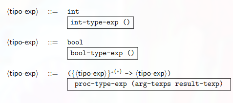

# Tipos de datos
* Los tipos definen las estructuras de almacenamiento disponibles para representar información;
* Determinan como el compilador interpreta el contenido de la memoria
* ***Un error de tipo*** se produce cuando se aplica una operación a un dato con características diferentes a las esperadas 

## Según el lenguaje
Según como el lenguaje de programación se comporta frente a los tipos, existen dos clasificaciones
* ***Fuertemente tipados*** requieren definiciones de tipos, no permiten errores de tipo. pej: Pascal, Java, c++
* ***Debilmente tipados*** tienen cierta flexibilidad para errores de tipos (pero sí existen errores de tipos) ej: racket

# Analisis de tipos
* El analisis de tipos es un paso del procesamiento de un lenguaje de programación
* El analisis de tipos se realizan para evitar que se presente errores en tiempo de ejecución

## Analisis de tipos en el interpretador
1. Se define un conjunto de tipos para el lenguaje -> un valor expresado $v$ es de tipo $t$
2. El analizador asigna un tipo para cada expresión en el programa
   * Si una expresión $e$ se le asigna un tipo $t$, entonces siempre que $e$ es interpretada, su valor sera de tipo $t$ 
   * Esta propiedad, hace que un sistema de tipos sea adecuado (sound)
3. El analizador debe inspeccionar también cada invocación de una operación en el programa, con el fin de verificar que los operando sean del tipo adecuado
    * Si esto no es posible se dice que que esta invocación posiblemente genere un error de tipo
4. Si se detectan errores de tipo, el analizador puede tomar algunas acciones, las cuales son, normalmente, parte del diseño del lenguaje.
    * Puede rehusarse a ejecutar el programa (Fuertemente tipado)
    * Puede aplicar medidas correctivas (Debilmente tipado)

# Lenguajes tipados
* En el diseño del programa se definen cuáles tipos habrán, si un valor puede tener más de un tipo, y si los tipos pueden ser determinados en tiempo de ejecución
* En algunos lenguajes, en cada ejecución, los valores incluyen una etiqueta para indicar su tipo
* Esto se llama tipado dinámico
* Racket es un lenguaje de tipado dinámico: las etiquetas son revisadas por `string?, number?,` etc.
* Las desventajas del tipado dinámico son: Insertar y revisar las etiquetas puede adicionar tiempo en ejecución, No soporta abstracción de datos

* Existen otros lenguajes de ***no tipado***, estos normalmente no detectan operaciones inapropiadas en tiempo de ejecución, si se aplican operaciones con los datos incorrectos los resultados no son especificados
* En dichos lenguajes se podría hacer una  multiplicación de dos caracteres
* El resultado de esa operación será lo que el hardware haga con la representación de los caracteres
* Esto se llama diseño político
* ***Los lenguajes tipados evitan*** los problemas mencionados anteriormente, analizando el programa antes de la ejecución para determinar cualquier llamado particular en el programa que pueda resultar en una operación no apropiada en tiempo de ejecución
* Esto es llamado ***chequeo de tipos estatico***
* Si un error es detectado el analizador podría producir una advertencia, insertar un código de revisión en tiempo de ejecución o rechazar el programa

 

# 
